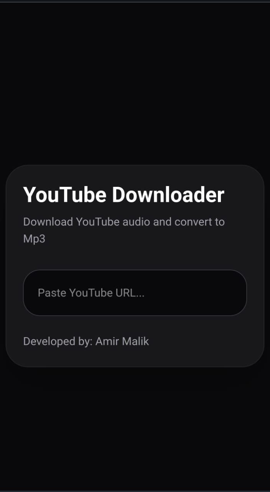
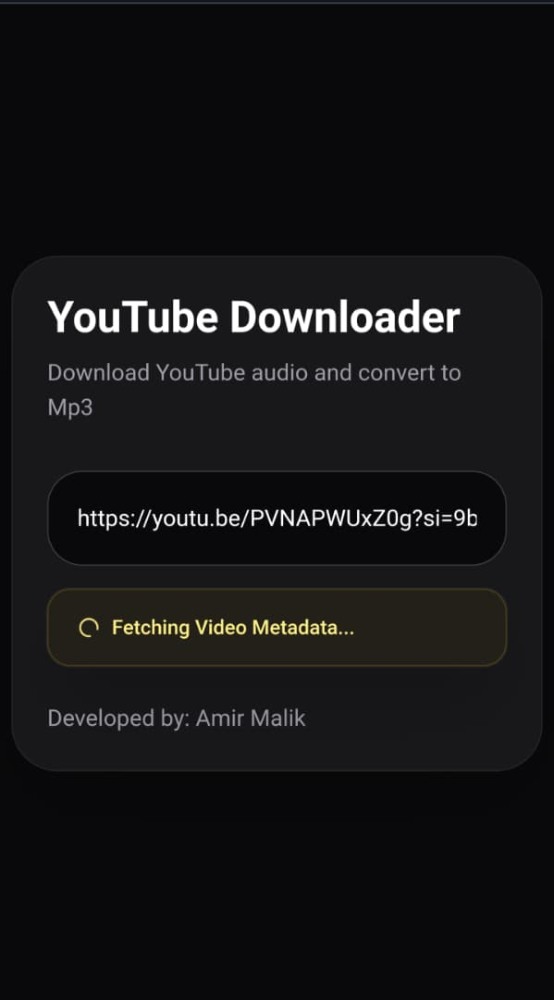
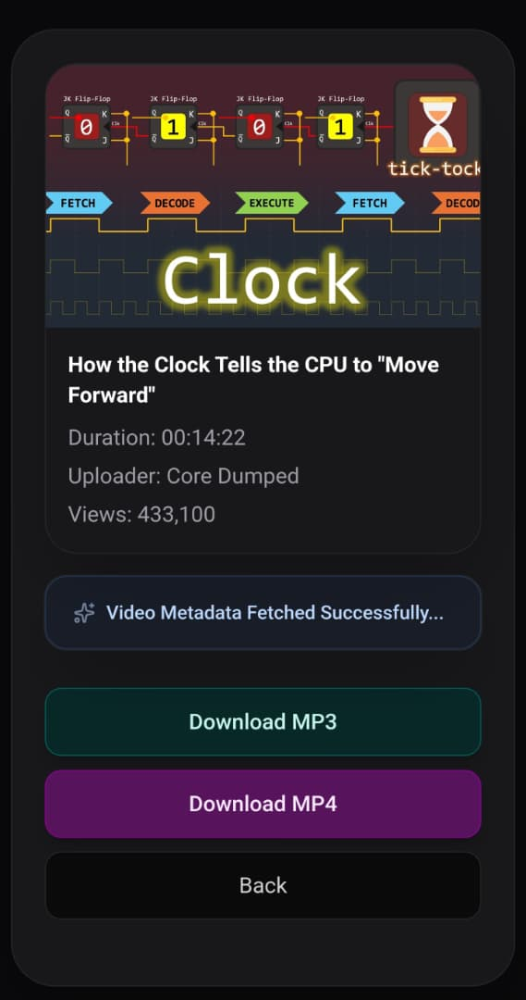
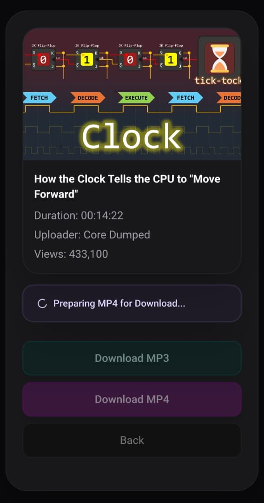
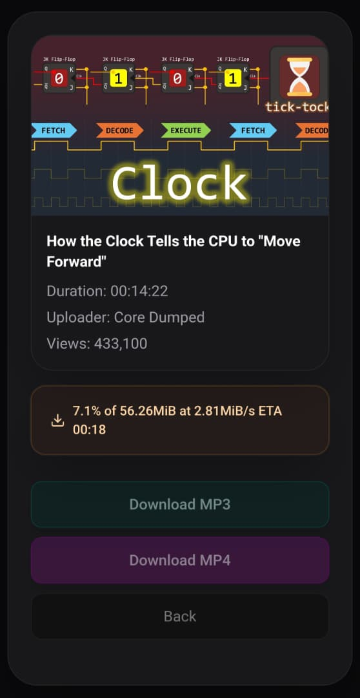

# YouTube Downloader

> Full-stack media downloader with real-time processing updates using SSE, FFmpeg, and yt-dlp.

A full-stack YouTube downloader built with React, Express, Node.js, FFmpeg, and yt-dlp.

Supports:
- MP3 conversion
- MP4 downloads
- Real-time progress updates using Server-Sent Events (SSE)
- Static large-file downloads
- Automatic file cleanup

## Screenshots


### Home Screen



### Fetching Video Metadata



### Fetched Metadata



### Download Started



### Download Progress



## Tech Stack

### Frontend

- React
- Vite
- TailwindCSS
- Axios

### Backend

- Node.js
- Express
- FFmpeg
- yt-dlp
- Server-Sent Events (SSE)

## Features

- Download YouTube videos as MP4
- Convert YouTube videos to MP3
- Real-time progress updates using SSE
- Multi-client SSE support
- Static file download architecture
- Automatic file cleanup system
- Filename sanitization
- Large-file download support

## Architecture Notes

### Real-Time Progress Updates with SSE

The application uses Server-Sent Events (SSE) to provide real-time status updates during:

- Metadata fetching
- Audio conversion
- Video processing
- Download preparation

A dedicated SSE connection is established between the frontend and backend, allowing the UI
to react to backend workflow events in real-time.

### Multi-Client SSE Architecture

The application avoids global shared SSE state by assigning each browser connection a unique
`clientId`.

Workflow:

1. Client establishes SSE connection using `EventSource API`
2. Server generates a unique `clientId`
3. Server associates generated `clientId` with the client's `response stream`
4. Client includes `clientId` in subsequent requests
5. Server uses `clientId` to push updates only to matching `SSE stream`

This prevents cross-client status and progress updates leakage and allows multiple users to
process downloads concurrently without conflicting status updates.

Server uses `Map` data structure to associate clientIds with their respective response streams,
because `Map` allows O(1) lookup.

### FFmpeg + yt-dlp Workflow

The backend uses:

- `yt-dlp` for downloading media streams
- `FFmpeg` for audio conversion to MP3

Workflow:

1. Fetch video metadata
2. Download media using yt-dlp
3. Convert to MP3 (in case of MP3 download) using FFmpeg
4. Expose downloadable files through static serving
5. Automatically clean up generated files after a configured duration

### Static Download Architecture

Initially, downloads were served using Express `res.download()`.

Large media files caused connection instability and aborted downloads 
when combined with long-lived SSE connections.

The architecture was redesigned to:

- Generate downloadable files
- Serve files statically through Express middleware
- Force browser downloads using `Content-Disposition`

This significantly improved:

- Large-file stability
- Download reliability
- Overall application simplicity

### File Cleanup System

Generated media files are automatically deleted after a configurable
timeout to avoid unnecessary disk usage.

This cleanup system helps keep the server lightweight during repeated
downloads.

## Installation

### Clone Repository

git clone https://github.com/amirmalik798/youtube-downloader.git

### Backend Setup

```bash
cd server
npm install
npm run dev
```

### Frontend Setup

```bash
cd client
npm install
npm run dev
```

## Environment Variables

### Backend (`server/.env`)

```env
PORT=3000
DOWNLOADS_DIR=downloads
CLEANUP_TIME=600000
```

### Frontend (`client/.env`)

```env
VITE_API_BASE_URL=http://localhost:3000/api/youtube
VITE_API_SERVER=http://localhost:3000
```

## Requirements

Before running the project, make sure the following dependencies are installed
and available in your system PATH:

- `FFmpeg`
- `yt-dlp`
- `Node.js`


